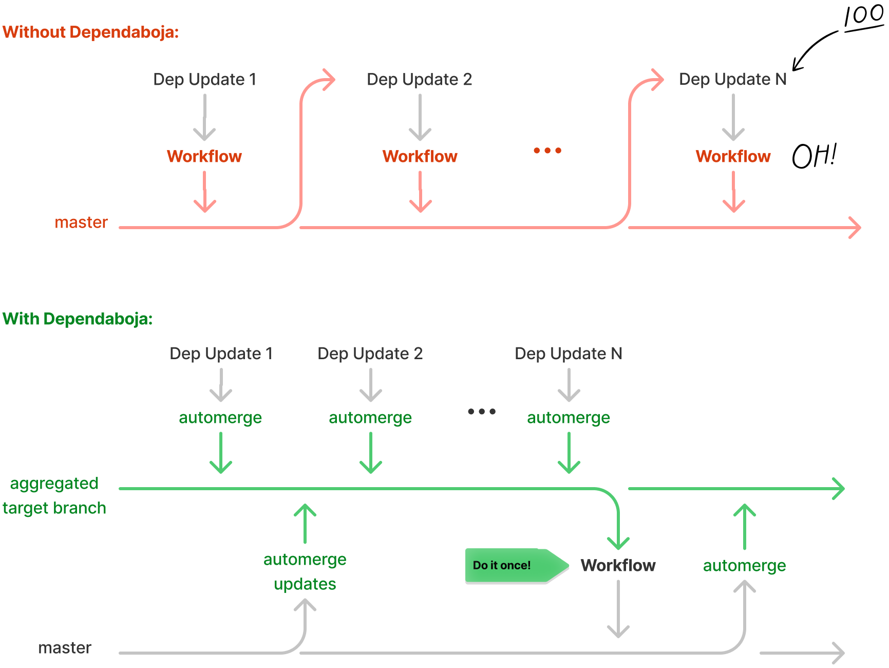

# Dependaboja

This is an action that lets you to merge dependabot PRs to aggregated branches
automatically and keep these aggregated branches in sync with master.
By using this approach you won't need to pass hundreds dependency PRs through
your workflow. Instead you can work with smaller amount of branches.



## How to use

### Prepare your dependabot configuration

Dependaboja's approach suggests to aggregate all dependency updates
in a small amount of branches depending on importancy, frequency and possible effect.

For instance, in the following configuratin we aggregate all dependencies in
two branches: major and minor. Minor updates are expected to be frequent but
they might be easier to update and test, while major might require more attention.

**.github/dependabot.yml**
```
version: 2
updates:
  - package-ecosystem: npm
    directory: /
    target-branch: deps/npm-maj
    schedule:
      interval: weekly
    open-pull-requests-limit: 3
    ignore:
      - dependency-name: '**'
        update-types:
          - 'version-update:semver-minor'
          - 'version-update:semver-patch'

  - package-ecosystem: npm
    directory: /
    target-branch: deps/npm-min
    schedule:
      interval: weekly
    open-pull-requests-limit: 3
    ignore:
      - dependency-name: '**'
        update-types:
          - 'version-update:semver-major'
```

### Configure your workflow

Then use Dependaboja from workflow:

**.github/workflows/dependaboja.yml**
```
name: dependaboja
on:
  push:
    branches: [master]
  pull_request:
    branches: [deps/**]

permissions:
  pull-requests: write
  contents: write

jobs:
  dependaboja:
    runs-on: ubuntu-latest
    steps:
      - name: Check out Git repository
        uses: actions/checkout@v2
      - name: Dependaboja
        uses: evoja/dependaboja@v0
```

## Options
All parameters are optional.

#### merge_type

Way of merge to use for syncing: `merge`, `rebase`, `squash`. Default is `rebase`.

#### committer_name, committer_email

Author of merge commits during syncing. Default is `dependaboja<-->`.

#### disabled_pr_targets

Comma separated list of branches wich are not allowed to be a PR target for auto merge. Default is `master,main`.

If the workflow gets triggered by a PR with a disabled target, it ignores the PR and exits with success status.

#### sync_with
Comma separated list of branches which should be merged to agregated dependency branches automatically. Default is `master,main`.

If the workflow gets triggerd by a push to another branch, it ignroes the push
and exists with success status.

#### fetch_depth

We need a deep fetch in order to merge. It limits the max value. Default is `0`.

You might want to use it for repositories with huge amount of commits when you know
that some smaller number is sufficient for merging.

#### create_aggregated_branches_if_missed

If an aggregated target branch is missed Dependaboja creates it.
Default value is `true`.

There are different reasons why target branches can be missed.
They can be deleted automatically by GitHub after pushing updates
to `master` with a PR. Also it can be a boring work to create them
manually on the original setup because it might be plenty
of aggregated branches. In this case they can be configured
in `dependabot.yml` only and Dependaboje creates all target branches
for you.

Having target branches in repository in important because otherwise
dependabot becomes stuck with errors on missed branches.